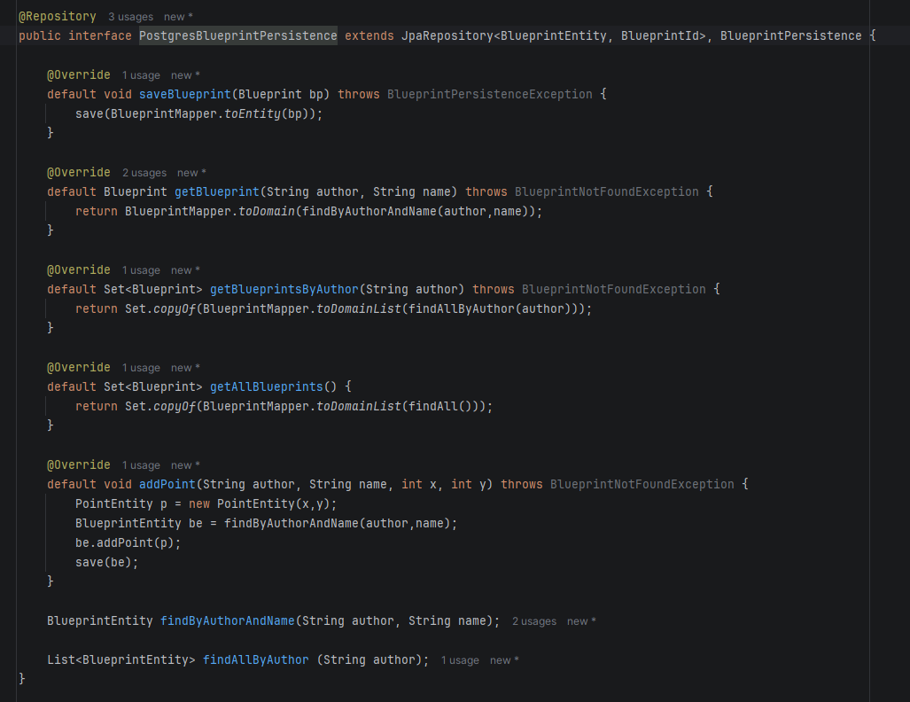
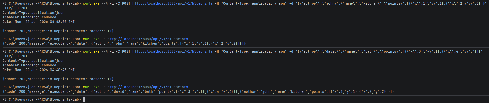
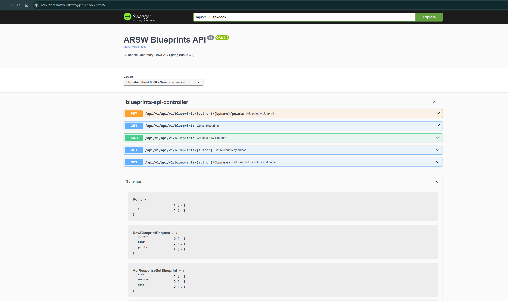
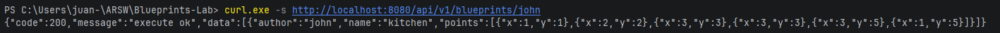
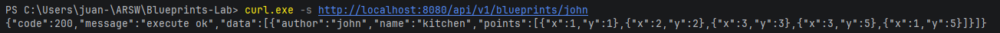
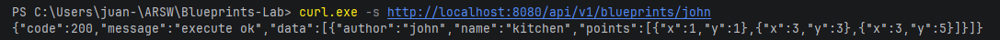
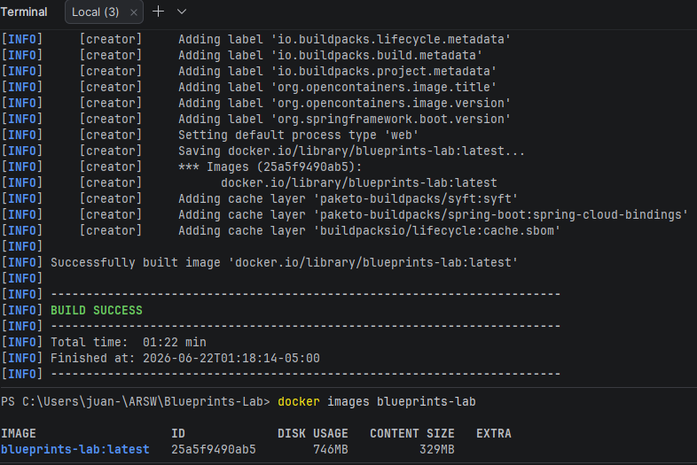
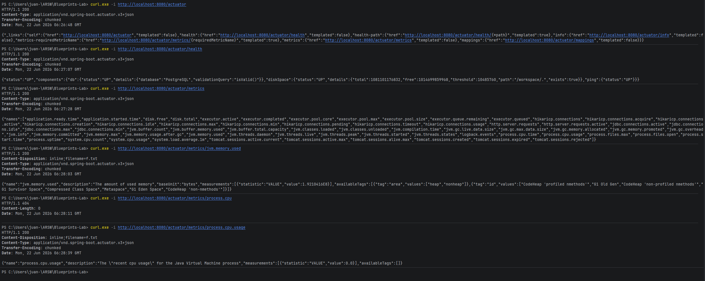

## Laboratorio #4 – REST API Blueprints (Java 21 / Spring Boot 3.3.x)
# Escuela Colombiana de Ingeniería – Arquitecturas de Software  

---

## 📋 Requisitos
- Java 21
- Maven 3.9+

## ▶️ Ejecución del proyecto
```bash
mvn clean install
mvn spring-boot:run
```
Probar con `curl`:
```bash
curl -s http://localhost:8080/blueprints | jq
curl -s http://localhost:8080/blueprints/john | jq
curl -s http://localhost:8080/blueprints/john/house | jq
curl -i -X POST http://localhost:8080/blueprints -H 'Content-Type: application/json' -d '{ "author":"john","name":"kitchen","points":[{"x":1,"y":1},{"x":2,"y":2}] }'
curl -i -X PUT  http://localhost:8080/blueprints/john/kitchen/points -H 'Content-Type: application/json' -d '{ "x":3,"y":3 }'
```

> Si deseas activar filtros de puntos (reducción de redundancia, *undersampling*, etc.), implementa nuevas clases que implementen `BlueprintsFilter` y cámbialas por `IdentityFilter` con `@Primary` o usando configuración de Spring.
---

Abrir en navegador:  
- Swagger UI: [http://localhost:8080/swagger-ui.html](http://localhost:8080/swagger-ui.html)  
- OpenAPI JSON: [http://localhost:8080/v3/api-docs](http://localhost:8080/v3/api-docs)  

---

## 🗂️ Estructura de carpetas (arquitectura)

```
src/main/java/edu/eci/arsw/blueprints
  ├── model/         # Entidades de dominio: Blueprint, Point
  ├── persistence/   # Interfaz + repositorios (InMemory, Postgres)
  │    └── impl/     # Implementaciones concretas
  ├── services/      # Lógica de negocio y orquestación
  ├── filters/       # Filtros de procesamiento (Identity, Redundancy, Undersampling)
  ├── controllers/   # REST Controllers (BlueprintsAPIController)
  └── config/        # Configuración (Swagger/OpenAPI, etc.)
```

> Esta separación sigue el patrón **capas lógicas** (modelo, persistencia, servicios, controladores), facilitando la extensión hacia nuevas tecnologías o fuentes de datos.

---

## 📖 Actividades del laboratorio

### 1. Familiarización con el código base
- Revisa el paquete `model` con las clases `Blueprint` y `Point`.  
- Entiende la capa `persistence` con `InMemoryBlueprintPersistence`.  
- Analiza la capa `services` (`BlueprintsServices`) y el controlador `BlueprintsAPIController`.

### 2. Migración a persistencia en PostgreSQL
- Configura una base de datos PostgreSQL (puedes usar Docker).  
- Implementa un nuevo repositorio `PostgresBlueprintPersistence` que reemplace la versión en memoria.  
- Mantén el contrato de la interfaz `BlueprintPersistence`.  

---
Comando para construir y iniciar contenedores en Docker:

```bash
docker compose up --build
```

Interfaz de respositorio con persistencia en base de datos usando Postgres



---

### 3. Buenas prácticas de API REST
- Cambia el path base de los controladores a `/api/v1/blueprints`.  
- Usa **códigos HTTP** correctos:  
  - `200 OK` (consultas exitosas).  
  - `201 Created` (creación).  
  - `202 Accepted` (actualizaciones).  
  - `400 Bad Request` (datos inválidos).  
  - `404 Not Found` (recurso inexistente).  
- Implementa una clase genérica de respuesta uniforme:
  ```java
  public record ApiResponse<T>(int code, String message, T data) {}
  ```
  Ejemplo JSON:
  ```json
  {
    "code": 200,
    "message": "execute ok",
    "data": { "author": "john", "name": "house", "points": [...] }
  }
  ```
---

Ejemplo crear blueprint:

```bash
curl.exe --% -i -X POST http://localhost:8080/api/v1/blueprints -H "Content-Type: application/json" -d "{\"author\":\"john\",\"name\":\"kitchen\",\"points\":[{\"x\":1,\"y\":1},{\"x\":2,\"y\":2}]}"
```

Obtener todos los blueprints:

```bash
curl.exe -s http://localhost:8080/api/v1/blueprints         
```

Agregar un punto:
```bash
curl.exe --% -i -X PUT http://localhost:8080/api/v1/blueprints/john/kitchen/points -H "Content-Type: application/json" -d "{\"x\":3,\"y\":3}"
```




### 4. OpenAPI / Swagger
- Configura `springdoc-openapi` en el proyecto.  
- Expón documentación automática en `/swagger-ui.html`.  
- Anota endpoints con `@Operation` y `@ApiResponse`.

---

Documentación Swagger:



---

### 5. Filtros de *Blueprints*
- Implementa filtros:
  - **RedundancyFilter**: elimina puntos duplicados consecutivos.  
  - **UndersamplingFilter**: conserva 1 de cada 2 puntos.  
- Activa los filtros mediante perfiles de Spring (`redundancy`, `undersampling`).  

---
Ejemplo sin filtros:



Ejemplo filtro redundancy:



Ejemplo filtro undersampling:



**Bonus**:  
---
- Imagen de contenedor (`spring-boot:build-image`).

Crear imagen

```bash
mvn -U clean spring-boot:build-image -DskipTests
```

---
- Métricas con Actuator.  



Endpoints disponibles:

```bash
curl.exe -i http://localhost:8080/actuator
```

Health:

```bash
curl.exe -i http://localhost:8080/actuator/health
```

Métricas:

```bash
curl.exe -i http://localhost:8080/actuator/metrics
```

Mappings:
```bash
curl.exe -i http://localhost:8080/actuator/mappings
```